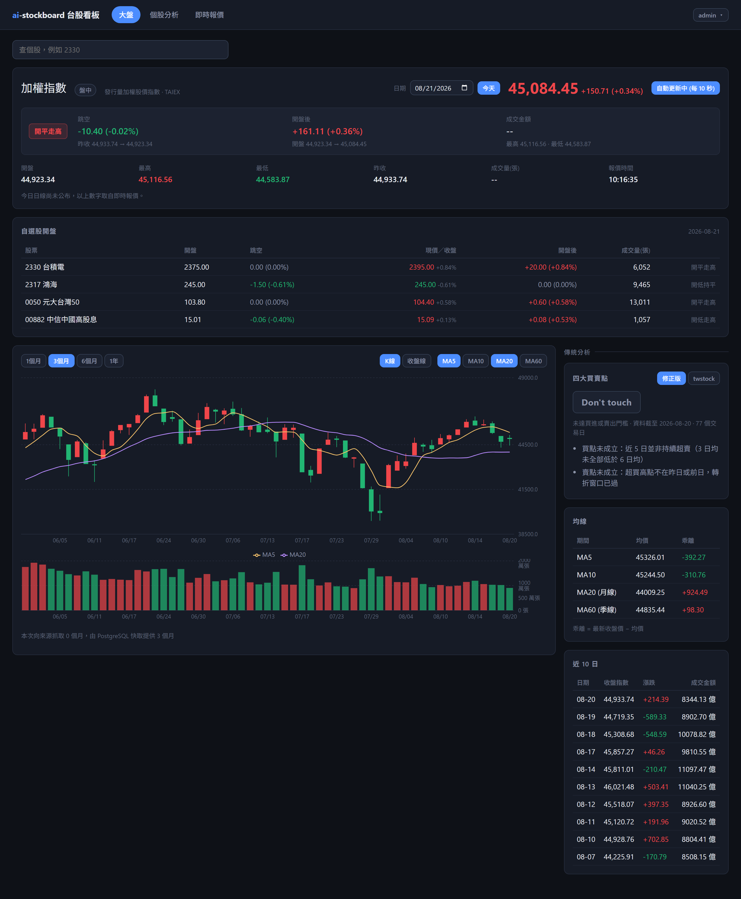
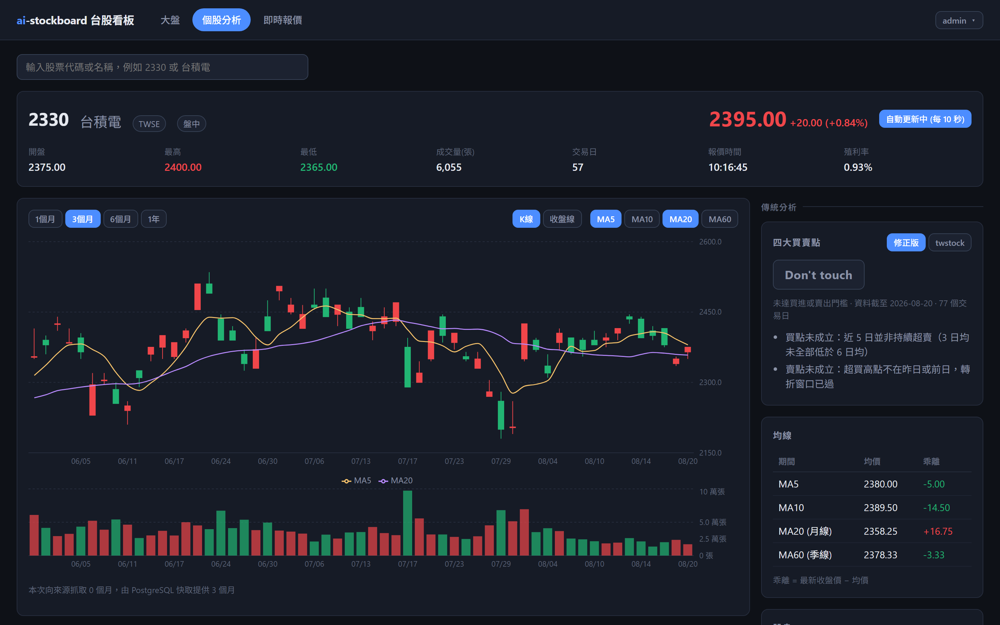
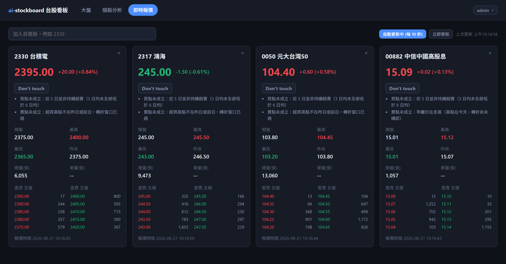
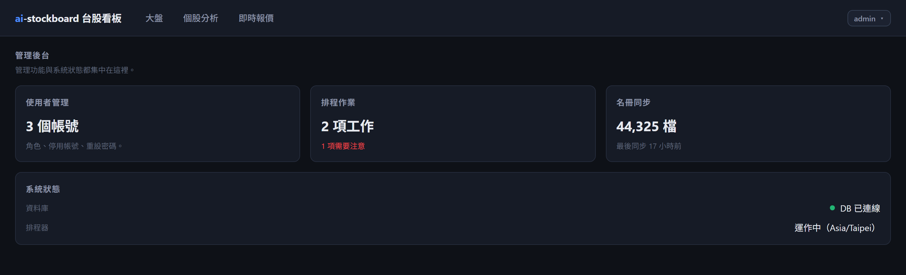
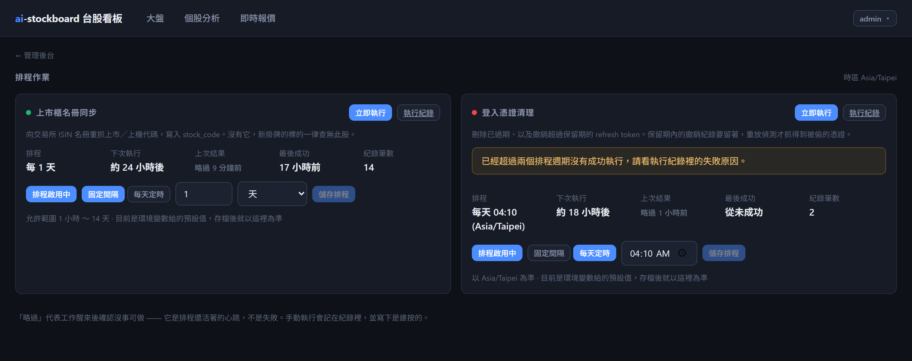
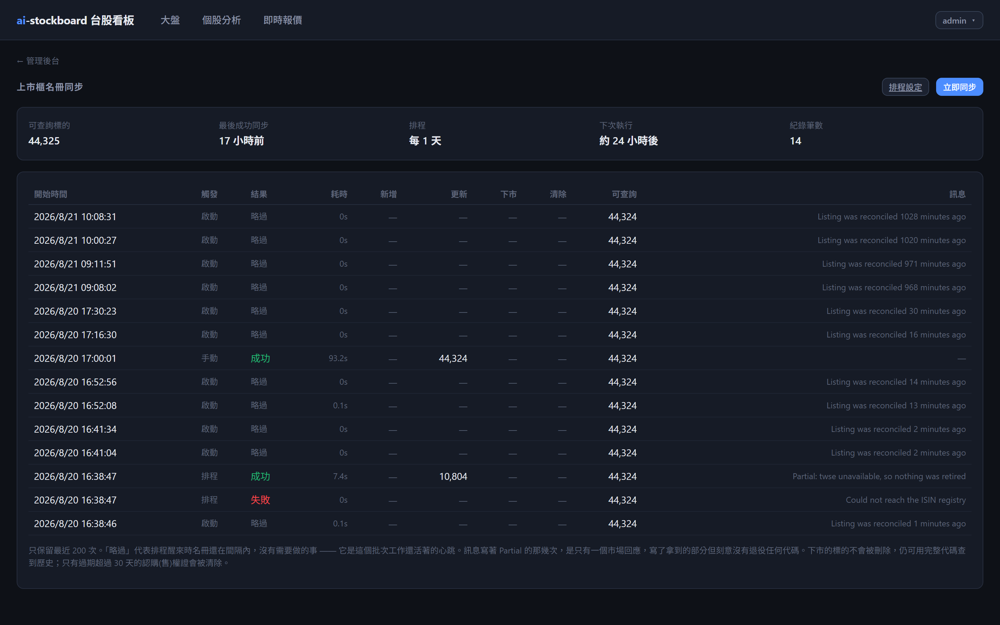
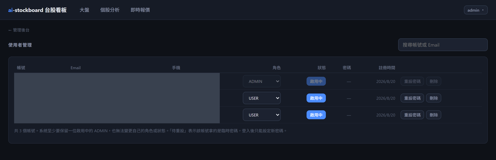

# ai-stockboard

台股看板服務。預設畫面是**台股大盤**（加權指數）看板，另可查個股歷史 K 線、即時報價與基本資料，
並對大盤與個股產生同一套分析結果。

分析分成三種，可以互相對照：

- **傳統分析** — 規則式技術分析：均線與四大買賣點。已完成。
- **訊號回測** — 把上面那條規則在歷史日線上重跑一遍，算它的命中率與同期基準。已完成。
- **AI 分析** — 由模型對同一份行情資料給出進出場與部位建議。已完成，但還沒有自己的回測，
  所以它的判讀目前無法像四大買賣點那樣拿出一個歷史命中率。

行情資料（TWSE／TPEX 日成交、即時報價、上市櫃清單）來自 [twstock](https://github.com/mlouielu/twstock)，
原始碼收在 `vendor/twstock/`，以 editable 方式安裝，之後為了 AI 分析要調整取數邏輯時可以直接改。
本服務負責資料落地、速率限制、HTTP API、Web UI 與分析。

```
ai-stockboard/
├── deployment/          docker-compose.yml + .env（DB、server、frontend 共用同一份設定）
├── server/              FastAPI (uv) + Dockerfile
├── frontend/            React 19 + Vite + Recharts（pnpm）+ Dockerfile / nginx/
├── docs/
│   └── screenshots/     The images this README embeds, captured by the script below
├── tools/
│   └── screenshots/     Playwright script that re-takes them from a running stack
└── vendor/
    └── twstock/         行情資料來源（MIT，含原始 test/）
```

---

## Screenshots

Every image below is captured from a running stack by `tools/screenshots`, not
drawn by hand. Re-running the script after a UI change refreshes the whole set,
which is the only way screenshots in a README stay true to the thing they claim
to show.

### Market board — `/`

The landing view. While the session is open the index is the live one, ticking
every 10 seconds; outside it the board falls back to the last close and says so.
Underneath sit the opening intel for the watchlist, a K-line chart with the
moving averages, and the same Best Four Point verdict individual stocks get —
here applied to the index itself.



### Stock view — `/stock/:sid`

History, dividends and analysis for one company. The Best Four Point card
reports its reasoning, not just its verdict: on most days the honest answer is
"no signal", and the reasons are what make that answer useful rather than
frustrating. `修正版` / `twstock` switches between the corrected rules and the
upstream ones — see [四大買賣點：兩套規則](#四大買賣點兩套規則).



### Realtime quotes — `/realtime`

Watchlist quotes with the five-level order book, polled every 10 seconds while
the market is open. This is the one view that requires an account, for the
reason set out in [Realtime quotes require sign-in](#realtime-quotes-require-sign-in).



<details>
<summary><b>Admin views</b> — the hub, background jobs, the listed-company roster, accounts</summary>

`/admin` gathers everything an ADMIN can do, and leads with whether anything
needs attention.



`/admin/jobs` is where a schedule is changed and a job is run by hand. A job
that has missed two cycles says so rather than waiting to be noticed.



`/admin/stock-codes` covers the roster this service maintains itself, with the
run history behind it — including the skips, which are the heartbeat that proves
the schedule is alive.



`/admin/users` handles roles, deactivation and password resets. The first three
columns are masked during capture: they are real account data in whichever
database the run points at, and this image is committed.



</details>

### Capturing them again

The stack has to be running — the script drives a real browser against a real
API, because a screenshot of mocked data documents the mock.

```bash
cd tools/screenshots
pnpm install
pnpm setup          # once: downloads the Chromium build Playwright drives
pnpm capture        # public views only
```

Views behind a session are skipped, and named in the output, unless credentials
are supplied:

```bash
SHOT_EMAIL=admin@example.com SHOT_PASSWORD=... pnpm capture
```

| Variable | Default | |
|----------|---------|--|
| `SHOT_BASE_URL` | `http://localhost:8100` | The compose frontend. Use `http://localhost:5173` for the Vite dev server. |
| `SHOT_API_URL` | = `SHOT_BASE_URL` | Only a split deployment needs this; nginx and Vite both proxy `/api`. |
| `SHOT_OUT_DIR` | `docs/screenshots` | |
| `SHOT_EMAIL`, `SHOT_PASSWORD` | — | Unset means public views only. A non-ADMIN account gets everything but the admin views. |
| `SHOT_LOCALE` | `zh-TW` | `en` captures the English UI instead. |
| `SHOT_WIDTH`, `SHOT_HEIGHT` | `1440`, `900` | |
| `SHOT_SCALE` | `2` | Device pixel ratio. |
| `SHOT_SETTLE_MS` | `1200` | Pause after the network goes quiet. Recharts animates in JS, so an idle network does not mean a finished chart. |
| `SHOT_ONLY` | — | Comma-separated shot names, for re-taking one. |

The script only reads. It signs in with what it is given and navigates; it never
registers an account or writes to the database.

---

## 快速開始

需要 **Docker**、**uv**、**Node 22+** 與 **pnpm**（`corepack enable pnpm` 即可）。

```bash
# 1. 資料庫（開發時只起 db，前後端跑在本機才有 hot reload）
cd deployment
cp .env.example .env
docker compose up -d db
docker compose ps                     # ai-stockboard-db ... (healthy)

# 2. 後端  http://localhost:8000
cd ../server
uv sync
uv run uvicorn app.main:app --reload --port 8000

# 3. 前端  http://localhost:5173
cd ../frontend
pnpm install
pnpm dev
```

打開 <http://localhost:5173>，進站就是大盤看板。API 文件在 <http://localhost:8000/docs>。

前端 dev server 會把 `/api` proxy 到 `localhost:8000`，開發時不會遇到 CORS。

---

## Tests and CI

These are not a coverage target. They pin the behaviours that would fail
silently if someone "simplified" them, or if twstock's return types changed:

| | What would go missing without the test |
|---|---|
| `_GrsBestFourPoint` | The 乖離 gate and close-vs-close volume-shrink rules regress to twstock's bugs. The 20 000-sequence experiment in this README never became a regression check. |
| Backtest `WINDOW_BARS` | The replay feeds each day a trailing slice so the walk is O(n). If it is ever too short the stock page and the backtest disagree about the same day, and neither says so. |
| Backtest look-ahead | Orders fill at the *next* bar's open. Filling at the signal bar's close would lift every number in the product and is invisible in the output. |
| Backtest pooling | Pooled rates come from summed counts. Averaging per-stock rates lets a three-signal stock weigh as much as an eighty-signal one -- the exact distortion pooling removes. |
| Refresh-token replay | A reused token would stop wiping every session. |
| `must_change_password` | Restricted mode is two `Depends()` choices, not middleware. A third bare `get_authenticated_user` compiles. |
| Alembic baseline / `upgrade_to_head` | `create_all` and `schema_patches.py` are gone. Editing the frozen baseline, or booting without `upgrade head`, is how a running database silently drifts from the models. |
| Sliding-window throttle | TWSE's 3-per-5s ban is enforced only by this loop. |
| `refreshPromise` in `client.ts` | Concurrent 401s would fire parallel refreshes; all but one look stolen to the server and the user is signed out at random. |

```bash
cd server && uv sync && uv run pytest
cd frontend && pnpm install && pnpm lint && pnpm test && pnpm build
```

`pnpm build` still runs `tsc -b` (the English locale and the rest of the
typecheck). GitHub Actions runs the same four commands on every push and pull
request to `main` / `develop`.

---

## 部署

### 全部跑在 Docker

三個服務都由 `deployment/docker-compose.yml` 定義，一行指令起完：

```bash
cd deployment
cp .env.example .env            # 還沒複製過的話
docker compose up -d --build
docker compose ps               # db / server / frontend 都要 (healthy)
```

打開 <http://localhost:8100>，進站就是大盤看板。

| 服務 | 內容 | Host port | Bound to |
|---|---|---|---|
| `db` | postgres:16-alpine，資料存在 `stockboard-pgdata` volume | `5433` | `127.0.0.1` |
| `server` | FastAPI + uvicorn，`server/Dockerfile` | `8000` | `127.0.0.1` |
| `frontend` | vite build 產物由 nginx 提供，`frontend/Dockerfile` | `8100`, `8443` (TLS) | `0.0.0.0` |
| `db-backup` | nightly `pg_dump` into `deployment/backups/` on the host | — | — |

Only the frontend is published on every interface. `ports: "5433:5432"` means
*all* interfaces, so on a host without a firewall that line is the database on
the internet -- and neither the database nor the API is reached that way by
anything in this deployment: the containers talk over the compose network, and
browsers reach the API through nginx at `/api`. The published ports are for
`psql` and `curl` from the host, which loopback covers. Set `POSTGRES_BIND` or
`SERVER_BIND` to `0.0.0.0` when you have actually decided otherwise.

nginx 把 `/api` 與 `/docs` proxy 到 `server:8000`，瀏覽器全程同源，所以 CORS 不會參與；
其餘路徑 fallback 到 `index.html` 交給 react-router。啟動順序由 healthcheck 串起來：
`db` healthy 才起 `server`，`server` healthy 才起 `frontend`。

兩件與 build context 有關的事：

- **server 的 build context 是專案根目錄**（`context: ..` + `dockerfile: server/Dockerfile`），
  因為 `server/pyproject.toml` 以 editable path 依賴 `../vendor/twstock`，兩棵樹的相對位置要保留。
- **frontend 的 build context 是 `frontend/`**，多階段建置：`node:22-alpine` 用 corepack 起 pnpm，跑 `pnpm install --frozen-lockfile && pnpm build`，
  產物 COPY 進 `nginx:1.27-alpine`。最終 image 49 MB，不含 Node。

容器內的 `POSTGRES_HOST` / `POSTGRES_PORT` 由 compose 覆寫成 `db` / `5432`；
`.env` 裡那組 `localhost:5433` 是給「server 跑在本機」時用的，兩種跑法共用同一份檔案。

改了程式碼要重新建置：

```bash
docker compose up -d --build server     # 或 frontend
```

### Security headers

nginx sends a fixed set of headers on every route, from
`frontend/nginx/includes/security-headers.conf`:

| Header | Value | Why |
|---|---|---|
| `Content-Security-Policy` | `default-src 'self'; script-src 'self'; …` | See below -- the one that earns its keep |
| `X-Content-Type-Options` | `nosniff` | Stops a response being executed as a type it did not declare |
| `X-Frame-Options` | `DENY` | Clickjacking, for browsers predating `frame-ancestors` |
| `Referrer-Policy` | `strict-origin-when-cross-origin` | Keeps the path (which can carry a stock code) off outbound referers |
| `Permissions-Policy` | `geolocation=(), microphone=(), …` | Nothing here needs those APIs |
| `Cross-Origin-Opener-Policy` | `same-origin` | Severs the `window.opener` handle |
| `Strict-Transport-Security` | `max-age=31536000; includeSubDomains` | **Only over TLS** -- see the TLS section |

CSP is the one that matters, and it is here because of a limitation admitted
further down this file: **the access token lives in `localStorage`, so any
script that runs on this origin can read it.** `script-src 'self'` is what stops
an injected `<script src=…>` or an inline payload from being that script. The
two mitigations belong together -- the token storage decision is only defensible
with the policy in place.

Two deliberate holes:

- **`style-src` allows `'unsafe-inline'`.** React writes style props through the
  CSSOM, which CSP does not govern at all, but Recharts emits `style` attributes
  on the SVG it renders and those are blocked without it. A style cannot read
  `localStorage`; a script can, and scripts stay locked to `'self'`.
- **`/docs` and `/redoc` get no headers at all.** Swagger UI is a CDN bundle
  with an inline bootstrap script, which this CSP blocks outright. A policy that
  breaks the page it is protecting only teaches people to turn it off, so those
  two paths are excluded — do not publish that port on an untrusted network.

`add_header` does not merge in nginx: a `location` that declares any header of
its own discards every header inherited from `server`. That is why the snippet
is `include`d once per location rather than once at the top, and why
`/assets/` -- which sets its own `Cache-Control` -- would silently lose the
whole set if it were not.

### TLS

Out of the box the frontend serves plain HTTP, and says so in its log. Give it a
certificate and it serves HTTPS instead:

```bash
cd deployment
cp /etc/letsencrypt/live/example.com/fullchain.pem certs/
cp /etc/letsencrypt/live/example.com/privkey.pem   certs/
docker compose up -d frontend
```

The container's entrypoint looks for both files at start and picks its config
from what it finds -- there is no flag and no second image. With a certificate:
443 serves the app, port 80 redirects to it, and HSTS is sent. Without one: port
80 serves the app and HSTS is not sent, because a policy announced over plain
HTTP is ignored by browsers anyway, and announcing it before TLS works is how a
hostname makes itself unreachable for a year.

`/healthz` answers on port 80 in both modes and is never redirected. The
container healthcheck uses it: following a redirect into a self-signed
certificate would report the container unhealthy for a reason that has nothing
to do with it.

Certificates are mounted, never baked into the image -- an image carrying a
private key is an image nobody can push to a registry. `deployment/certs/` is
git-ignored apart from its README. Renewal is not automated here: copy the new
files in and restart the frontend. If you would rather not run TLS in this
compose file at all, terminate it in front (Caddy, a cloud load balancer,
Cloudflare) and leave the frontend on plain HTTP -- the `$scheme`-driven HSTS
header means nothing here has to change either way, as long as the proxy sets
`X-Forwarded-Proto`.

### Resource limits and log rotation

Every service has a memory ceiling, a CPU ceiling, and a capped log:

| | CPU | Memory | Override |
|---|---|---|---|
| `db` | 1.0 | 768m | `DB_CPU_LIMIT` / `DB_MEMORY_LIMIT` |
| `server` | 2.0 | 1g | `SERVER_CPU_LIMIT` / `SERVER_MEMORY_LIMIT` |
| `frontend` | 0.5 | 128m | `FRONTEND_CPU_LIMIT` / `FRONTEND_MEMORY_LIMIT` |
| `db-backup` | 0.5 | 256m | `BACKUP_CPU_LIMIT` / `BACKUP_MEMORY_LIMIT` |

The point is not to size the service accurately -- it is that a job which goes
wrong should cost its own container rather than the host. Without a limit, one
runaway fetch takes the machine down to swap and PostgreSQL with it; with one,
the container is OOM-killed and restarted by `restart: unless-stopped` while
everything else keeps serving. Raise them in `.env` if a limit is genuinely too
low; deleting them from the compose file gets you back to the failure mode they
exist for.

Container logs are capped at 3 × 10 MB per service for the same reason: nothing
rotates Docker's JSON log by default, and a crash loop writing a few hundred
lines a second fills the disk -- which stops PostgreSQL too.

### Backups

The database is the only copy of everything this service cannot fetch again:
user accounts, watchlists, the job schedules an admin edited, and the run
history that says whether the nightly jobs are healthy. Prices can be pulled
from the exchange a second time; none of that can.

The `db-backup` container runs `pg_dump` once a day and writes into
`deployment/backups/` **on the host**, not into a Docker volume. That is the
whole point of the arrangement -- a named volume would be deleted by the same
`docker compose down -v` that deletes the database, so it would fail in exactly
the case a backup exists for.

```bash
cd deployment
docker compose exec db-backup /opt/backup/backup.sh   # take one right now
docker compose exec db-backup /opt/backup/restore.sh  # list what is on disk
docker compose logs db-backup                         # did last night's run?
ls backups/
```

Tuned in `.env` (`BACKUP_AT`, `BACKUP_KEEP_DAYS`, `BACKUP_DIR`). The first start
takes a backup immediately when the directory is empty, so a new deployment is
covered from day one rather than from the first time 04:00 comes around.

Each dump is written under a `.partial` name and moved into place only after
`pg_restore --list` has read it back, so a run interrupted half way through
never leaves a file that looks like a good backup. Old dumps are pruned only
after a new one has been verified -- a failed backup must not also cost you the
copies it failed to replace.

To restore, stop the API first so it is not writing into the database being
replaced:

```bash
cd deployment
docker compose stop server
docker compose exec db-backup /opt/backup/restore.sh stockboard-20260821-040000.dump
docker compose start server
```

The restore asks you to type the database name before it does anything, and
terminates any other session still connected -- an open `psql` holds locks on
the objects `pg_restore` is about to drop, which is how a restore turns into a
half-applied schema.

This is one machine's disk: a dump next to the database covers a mistaken
`down -v`, an accidental `delete`, and a bad migration, but not the disk itself.
Point `BACKUP_DIR` somewhere else if that matters.

The backup directory is also mounted read-only into the API container, which is
the only reason a backup that stopped happening ever gets noticed: `/api/health`
reports the age of the newest `*.dump` and goes `degraded` past
`BACKUP_MAX_AGE_HOURS`. Only `*.dump` counts -- an interrupted run leaves
`*.dump.partial`, and treating that as a backup would undo the rename that makes
it safe. `docker compose logs db-backup` is still where the reason lives.

### Logs and request ids

Several requests and several background jobs run concurrently in one process,
so an unlabelled log interleaves them: a traceback from a job sits between two
lines of somebody's history fetch and nothing says which is which. Every line
therefore carries an id:

```
2026-08-21 04:00:03 INFO app.access [8f2a1c04d9b3e750]: GET /api/stocks/2330/history -> 200 in 412ms
2026-08-21 04:00:12 ERROR app.services.jobs.runner [job:stock_code_sync:1a2b3c4d]: job stock_code_sync failed (trigger=schedule) in 41.2s -- ConnectionError: ...
```

nginx mints one per request (`$request_id`) and passes it on as `X-Request-ID`;
the API adopts it, stamps it on everything logged while that request is in
flight, and echoes it back on the response -- so a user reporting "it failed at
14:02" can hand over the id their browser saw. An id arriving from a proxy
further out is kept, so a trace does not restart at our edge; it is checked
first (≤ 64 characters, `[A-Za-z0-9_.:-]`) because it is written verbatim into
every log line, and an unbounded value is a way to forge log entries.

Background jobs are not requests and get `job:<name>:<id>` instead, which is
what makes `grep job:stock_code_sync` pull one run's lines out of the noise --
including lines written deep inside a handler that knows nothing about jobs.

`LOG_FORMAT=json` swaps the text format for one JSON object per line, for a
shipper to parse; `LOG_LEVEL` sets the threshold. A failed job logs at `ERROR`
rather than `INFO`, because `INFO` is where log lines go to be filtered out.

One caveat: an *unhandled* exception's 500 response carries no `X-Request-ID`.
Starlette's `ServerErrorMiddleware` wraps the user middleware stack from the
outside and writes that response past ours. The log line still has the id, which
is the half that matters.

### What `/api/health` reports

There is no alerting stack in this deployment, and adding one is a separate
piece of work. What there is instead: the two failures that are otherwise
completely invisible are folded into the endpoint an uptime monitor is already
polling, and they move `status`.

```jsonc
{
  "status": "degraded",              // watch this field
  "database": "connected",
  "stock_codes_loaded": 2412,
  "stock_codes_synced_at": "2026-08-21T04:00:41Z",
  "jobs": {
    "failing": ["stock_code_sync"],  // most recent attempt failed
    "last_failure_at": "2026-08-21T04:00:12Z"
  },
  "backup": {
    "status": "stale",               // ok | stale | missing | unchecked
    "taken_at": "2026-08-18T04:00:07Z",
    "age_hours": 74.2
  },
  "alerts": [
    "background job(s) failing: stock_code_sync",
    "newest database backup is 74h old (limit 36h)"
  ]
}
```

`alerts` is empty exactly when `status` is `ok`, and each line is written to be
readable in an alert body at 03:00 -- "a job is failing" is not actionable, so
the jobs are named. Point any uptime monitor at this path and alert on `status`
or on `alerts` being non-empty.

Three things it deliberately does *not* do:

- **It never answers non-2xx.** The compose healthcheck polls this, so a 503
  would mark the server container unhealthy and stop the frontend from ever
  starting -- which is the wrong response to "last night's backup did not run".
  `status` carries the verdict; the HTTP code carries only "the process is up".
- **A failing job is judged on its latest attempt only.** One that failed at
  03:00 and succeeded on the 03:10 retry is working, and paging about it teaches
  people to ignore the page.
- **`backup: unchecked` is not a fault.** It means `BACKUP_STATUS_DIR` is unset,
  which is the normal state for a server run outside Docker. Compose sets it to
  the backup directory mounted read-only; `BACKUP_MAX_AGE_HOURS` (36h, not 24h,
  so one late run is not an alert) decides when a dump counts as stale.

### Schema migrations

Schema changes go through **Alembic**. The database is migrated on startup by
`app/migrations.py`, so `docker compose up -d --build` remains the whole
deployment procedure; a PostgreSQL advisory lock keeps two replicas booting at
once from running the same DDL twice.

```bash
cd server
uv run alembic current                                  # where is this database
uv run alembic revision --autogenerate -m "add x"       # write one from the models
uv run alembic upgrade head                             # apply
uv run alembic check                                    # models vs database: any drift?
uv run alembic upgrade head --sql                       # review the SQL, apply nothing
```

Always read what `--autogenerate` produced before committing it. It compares
the models against a live database and is good at columns, indexes and types;
it cannot know that a column is being renamed rather than dropped and re-added,
and it will happily generate the second.

`alembic check` is the one worth running in anger: it fails when the models and
the database disagree, which is the class of bug that used to be invisible.

**Why this replaced `create_all`.** `Base.metadata.create_all` only ever creates
tables that do not exist. It never alters one that does -- so a column added to
a shipped model was invisible to any database with data in it, and there was a
second mechanism (`app/schema_patches.py`, now deleted) holding one idempotent
`add column if not exists` per such column. That covered adding a column and
nothing else: no type change, no composite index, no drop, no data backfill.
The drift was not hypothetical. Adopting Alembic turned up an orphaned
`stock_code_sync_run` table and an `ix_dividend_event_sid_ex_date` index that
had been removed from the models but not from any running database, because
dropping is precisely what `create_all` cannot do; `0002_retire_create_all_leftovers`
is what finally removes them.

An existing deployment needs no manual step. `0001_baseline` is written
entirely in `IF NOT EXISTS` form, so it is a no-op against a database
`create_all` already built and fills in whatever it could not add after the
fact -- notably an index added to a model after its table had shipped, which
`create_all` never revisits. Stamping the database as up to date would have
been shorter, but a stamp asserts a match instead of establishing one, and
`alembic check` afterwards proves the difference.

### 單一服務部署（不用 Docker）

```bash
cd frontend && pnpm build         # 產生 frontend/dist
cd ../server && uv run uvicorn app.main:app --port 8000
```

server 偵測到 `frontend/dist` 存在時會把它掛在 `/`，用一個 port 就能跑完整站台。

**不要加 `--workers`。** 服務有數項 process 內狀態，多開一個 worker 會讓對 TWSE 的
速率變成兩倍，見 [Deployment is single-process](#deployment-is-single-process)。

---

## API

| Method | Path | 說明 |
|---|---|---|
| GET | `/api/health` | 服務、資料庫、背景作業與備份狀態；`status` 是給監控看的總結。見 [what /api/health reports](#what-apihealth-reports) |
| GET | `/api/stocks/search?q=&limit=` | 代碼／名稱搜尋 |
| GET | `/api/stocks/{sid}` | 個股基本資料 |
| GET | `/api/stocks/{sid}/history?months=6` | 歷史日成交. `months` 上限 24; 12 without a token, and `force=true` is **ADMIN** -- see [the fetch budget](#the-upstream-fetch-budget) |
| GET | `/api/stocks/{sid}/dividends?years=5` | 除權息. `years` 上限 10; 5 without a token, `force=true` is **ADMIN**, same reason |
| GET | `/api/stocks/{sid}/chips?days=10` | Institutional net buying and margin balances. `days` cap 15; 10 without a token, `force=true` is **ADMIN**. Dates come from `daily_price`; a cold session hits the shared limiter -- see [chip flow](#chip-flow) |
| GET | `/api/stocks/{sid}/analysis/traditional?months=6&rule_set=grs` | 傳統分析：MA5/10/20/60 + 四大買賣點. Backfills like `/history`, so the same `months` cap applies |
| GET | `/api/analysis/traditional?sids=2330,0050` | Batch 四大買賣點 from cached daily bars only (no TWSE fetch, max 20) |
| GET | `/api/stocks/{sid}/analysis/backtest?rule_set=grs` | One stock's replay, served from `backtest_result` and recomputed when its bars move. Carries the equity curve the card draws; fixed window, so no `months`. 422 when too few bars are landed |
| GET | `/api/analysis/backtest?sids=2330,0050&months=12` | Replays 四大買賣點 over cached bars and scores it against the base rate of the same days — see [how good is the signal](#how-good-is-the-signal-actually). Cache-only, max 20 |
| GET | `/api/realtime?sids=2330,0050` | 即時報價，最多 20 檔（**需登入**） |
| GET | `/api/market/open?date=&sids=` | Opening intel for one trading day: gap and drift for the index plus up to 20 watchlist codes. Defaults to today in Taipei; cache-only apart from the index's own backfill |
| GET | `/api/auth/registration-policy` | Whether signing up needs an ADMIN's approval. Public, read before the form renders |
| POST | `/api/auth/register` | 註冊。Under review it creates the account and returns `pending: true` **without tokens** — see [getting an account](#getting-an-account-and-how-often-you-may-guess) |
| POST | `/api/auth/login` | 登入，帳號或 Email 皆可. Throttled per account and per source IP; both answer 429 with `Retry-After` |
| POST | `/api/auth/refresh` | 換發 token（會輪替 refresh token） |
| POST | `/api/auth/logout` | 撤銷一組 refresh token |
| GET / PATCH | `/api/auth/me` | 讀取／更新自己的資料 |
| POST | `/api/auth/me/password` | 改密碼，登出其他所有裝置，並回一組新 token |
| GET | `/api/users?q=&pending=&limit=&offset=` | 使用者列表（ADMIN）. `pending=true` filters to the approval queue |
| GET / PATCH / DELETE | `/api/users/{user_id}` | 檢視／改角色與狀態／刪除（ADMIN） |
| POST | `/api/users/{user_id}/password-reset` | 重設密碼，回傳一次性臨時密碼（ADMIN） |
| POST | `/api/users/{user_id}/unlock` | Lift a login lockout early, leaving the password alone（ADMIN） |
| GET / PUT | `/api/watchlist` | Watchlist, whole-list read/write (signed in). Response includes `groups` and `group_by_sid`. PUT may overlay assignments. |
| POST | `/api/watchlist/groups` | Create a named folder on the same 20-stock list (signed in) |
| PATCH / DELETE | `/api/watchlist/groups/{group_id}` | Rename or delete a folder; stocks stay, they just ungroup (signed in) |
| GET | `/api/jobs` | Every background job: schedule, last run, next run (**ADMIN**) |
| GET | `/api/jobs/{job_id}/runs?limit=50` | One job's run history (**ADMIN**) |
| PATCH | `/api/jobs/{job_id}/schedule` | Change when a job fires (**ADMIN**) |
| POST | `/api/jobs/{job_id}/run` | Run now; answers 202 and continues server-side (**ADMIN**) |
| POST | `/api/stocks/sync?force=true` | Sync the listing and wait for it; superseded by the above (**ADMIN**) |
| POST | `/api/stocks/{sid}/analysis/ai` | AI position call: enter / exit / hold, and at what size (**需登入**) |
| GET | `/api/analysis/ai/quota` | Generations left on this account today (**需登入**) |

`{sid}` 可以是個股代碼，也可以是大盤 `t00`。

搜尋預設**排除認購(售)權證**（4.2 萬檔，佔全部代碼的 95%），加 `&include_warrants=true` 才會出現。

```bash
curl 'http://localhost:8000/api/stocks/2330/history?months=3'
curl 'http://localhost:8000/api/stocks/2330/analysis/traditional'
curl 'http://localhost:8000/api/analysis/traditional?sids=2330,2317,0050'
curl 'http://localhost:8000/api/stocks/2542/chips'

# Was the signal any good? Pooled across stocks is the readable number.
curl 'http://localhost:8000/api/stocks/2330/analysis/backtest'
curl 'http://localhost:8000/api/analysis/backtest?sids=2330,2317,0050'

# 即時報價要帶 access token，其餘行情端點不用
curl 'http://localhost:8000/api/realtime?sids=2330,6488' -H "Authorization: Bearer $ACCESS_TOKEN"

# 當日開盤情報 -- today by default, any past trading day with ?date=
curl 'http://localhost:8000/api/market/open?sids=2330,0050'
curl 'http://localhost:8000/api/market/open?date=2026-08-20&sids=2330,0050'
```

---

## 四大買賣點：兩套規則

`rule_set` 決定用哪個版本，**預設 `grs`**：

```bash
curl 'http://localhost:8000/api/stocks/2330/analysis/traditional'                    # grs（預設）
curl 'http://localhost:8000/api/stocks/2330/analysis/traditional?rule_set=twstock'   # 對照
```

回應會帶 `rule_set` 欄位，前端「四大買賣點」卡片右上角也可以直接切換。

### 為什麼需要兩套

`BestFourPoint` 不是 twstock 原創，是從 [toomore/grs](https://github.com/toomore/grs)
（`grs/best_buy_or_sell.py`，MIT，Toomore Chiang）移植過來的。逐條比對後發現移植時掉了兩件事：

**一、乖離轉折關卡失效。** grs 的 `bias_ratio()` 結尾有 `[0]`，把 `(bool, 轉折日, 值)` 裡的布林值取出來：

```python
# grs
return self.data.check_moving_average_bias_ratio(..., positive_or_negative=...)[0]
# twstock —— 少了 [0]，回傳整個 tuple
return self.stock.ma_bias_ratio_pivot(self.stock.ma_bias_ratio(3, 6), position=position)
```

非空 tuple 恆為真，於是 `if self.mins_bias_ratio() and any(check)` 退化成 `any(check)`，前置條件形同不存在。

**二、「量縮價不跌／價跌」比錯欄位。**

| | grs | twstock |
|---|---|---|
| 量縮價不跌 | 今收 > **昨收** | 今收 > **昨開** |
| 量縮價跌 | 今收 < **昨收** | 今收 < **昨開** |

昨天收長紅時，一根實際下跌的黑 K 會被標成「價不跌」並可能出 Buy。

其餘六條規則與 pivot 演算法本身（`ma_bias_ratio_pivot` vs grs 的 `__cal_ma_bias_ratio_point`）逐行等價，沒有問題。

### 影響有多大

兩萬組隨機價格序列跑下來：

| | 乖離關卡通過 | 出訊號 |
|---|---|---|
| `grs`（修正版） | 30.9% | **22.3%** |
| `twstock`（原樣） | 恆真 | **100%** |

twstock 版在兩萬組裡**沒有一次回傳 Don't touch**，而且與 grs 版可能給出相反結論。

### 修在哪裡

`server/app/services/analysis/traditional.py` 的 `_GrsBestFourPoint`，用繼承覆寫三個方法。
**`vendor/twstock/` 一行都沒動**——那份是刻意與 PyPI 1.5.1 保持 byte-identical 的快照。

有一個差異刻意保留：grs 的均線四捨五入到小數 6 位，twstock 是 2 位。只在極接近的平手情況下才有差別，
要對齊得連 `Analytics` 一起 fork，不值得。

---

## How good is the signal, actually?

四大買賣點 reads three columns — volume, open, close — and compares the two most
recent bars. There is no trend term, no position sizing, no institutional flow.
That is a narrow view of a market by construction, so before the signal is used
as a benchmark for anything else, it needs a number rather than a reputation.

`GET /api/analysis/backtest` produces one. It replays the exact function the
stock page calls (`traditional.best_four_point`) over the bars already in
`daily_price`, and reports what happened over the next 5 / 10 / 20 trading days.

**The base rate is the point.** A hit rate on its own is unreadable: the reader
has to supply a reference, and the one they supply is 50 %. It is almost never
50 %. In a window where 58 % of all days closed higher 20 bars later, a Buy rule
that is right 55 % of the time lost to owning the stock and ignoring the board.
So every response carries `baseline` — the same horizons measured over *every*
judged day, signal or not — beside the signal's own rates, and `edges` does the
subtraction:

```
edges[].buy_edge   = buy win rate  - baseline up rate
edges[].sell_edge  = sell win rate - baseline down rate   # not up rate
```

The sell side is spelled out because it is the step that gets quietly wrong: a
Sell is a get-out, so it competes with the days that *fell*, and its excess
return is the drop it avoided (baseline minus signal, the other way round).

**Pool before you conclude.** One stock's year fires a handful of signals, and a
rate off a handful moves twenty points on a single trade. Passing several codes
returns `pooled`, which sums wins and samples across the basket — sums, never an
average of per-stock rates, so a stock with forty signals does not get the same
vote as one with two. `pooled[].buy_edge` over a watchlist is the number that
actually answers whether the rule beats doing nothing.

Three things keep the replay honest, each pinned by a test in
`server/tests/test_backtest.py` because a wrong backtest still returns tidy
percentages and nothing downstream can tell:

- **No look-ahead.** A verdict is computed from bar `i`'s close, so it cannot be
  traded until bar `i+1` opens. Every simulated order fills at the next open.
- **Unfinished business stays unfinished.** A Buy four days before the window
  ends has no 20-day outcome; it is counted as `pending` and kept out of the
  rate rather than scored as though the horizon had elapsed. A position still
  open at the end is reported separately from completed trades.
- **The same engine.** Signals come from the function the card on the page
  calls. A backtest of a reimplementation measures the reimplementation.

A stock with too little history is listed with a `note` instead of being
dropped, and contributes nothing to `pooled` — otherwise a pooled rate drawn
from eleven stocks would present itself as covering the twenty that were asked
for.

The route is cache-only, like the traditional batch: twenty cold codes would
otherwise queue tens of month-fetches on the limiter the realtime poll shares.
Open a stock's page first to fill its bars.

## The scorecard on the board

[The section above](#how-good-is-the-signal-actually) is the engine and the API.
This is what a reader sees, and where the numbers live between page loads.

A **signal backtest card** sits under the Best Four Point verdict on the stock
page and the market board, and follows the rule-set switch on the card above
it, so the corrected and the upstream rules can be graded side by side. It adds
two things to what the batch route reports:

- an **equity curve** — following the signal against buying and holding, both
  indexed to the first judged bar and drawn on shared points, so the two can
  never be plotted over different ranges;
- a **trade simulation** — completed round trips, win rate, average holding
  period, and max drawdown for each curve.

### What it actually says

Uncomfortable things, mostly, which is the point of having built it:

| 2330, 12 months to 2026-08-20 | |
|---|---|
| Trading the signal | **+2.2 %** |
| Buying and holding | **+85.5 %** |
| Trade win rate | 75 % (3 of 4) |
| Time in market | **12 %** |

Three of four trades made money and the strategy still returned almost nothing,
because it was in cash seven days out of eight. That is why exposure is a
headline figure on the card rather than a footnote: it is the number that
reconciles a good hit rate with a bad result, and without it the two look
contradictory.

The hit rates are the worse news. Over the same window every buy horizon lands
37–43 percentage points *below* the baseline — in a market that mostly went up,
the rule picked entries that did worse than picking days at random.

### Why this one is cached and the batch is not

`backtest_result` holds one row per (stock, rule set): headline figures as
columns so "where does this signal work" is an `ORDER BY`, the equity curve and
signal list as JSONB because nothing queries into them.

The split follows from the window. The batch route takes a caller-chosen
`months`, which cannot be cached and does not need to be — pooling is its
point. The card is pinned to `BACKTEST_WINDOW_MONTHS` and backs a page anyone
can load, so it has to be a lookup rather than a 240-day replay per view.

Every row is derived and rebuildable from `daily_price`, which is what makes
the arrangement safe:

- the nightly **訊號回測預算** job is only a *warmer*, walking the stocks that
  already have bars;
- the endpoint is *self-healing* — a stock the job has never seen, or one that
  has traded since, is recomputed on the spot and stored on the way out.

So a cold cache costs a slower first card, never a missing or a wrong one. That
matters because the job can only ever know about stocks somebody has already
looked at.

Staleness is measured against the newest bar in `daily_price`, not against a
clock: a stock that has not traded since the last run does not need recomputing
however long ago that was, and one that has does, however recently the job
happened to fire.

### The window is fixed, on purpose

Twelve months (`BACKTEST_WINDOW_MONTHS`), not a range the card offers. A
one-month backtest produces two or three signals, and a win rate over three
samples renders exactly as authoritatively as one over eighty. Offering the
short window would mostly be offering a way to generate noise that looks like
evidence.

---


---

## 大盤（加權指數）

首頁 `/` 是大盤看板：即時指數、K 線與均線、四大買賣點、近 10 日。個股頁在 `/stock/:sid`，即時報價在 `/realtime`。
即時的部分需要登入（見〈[Realtime quotes require sign-in](#realtime-quotes-require-sign-in)〉），K 線與分析則不用。

大盤在後端就是一個 `sid` = **`t00`**，走的是跟個股完全相同的路由：

```bash
curl 'http://localhost:8000/api/stocks/t00'
curl 'http://localhost:8000/api/stocks/t00/history?months=3'
curl 'http://localhost:8000/api/stocks/t00/analysis/traditional'
curl 'http://localhost:8000/api/realtime?sids=t00' -H "Authorization: Bearer $ACCESS_TOKEN"
```

做得到這件事是因為 `server/app/services/market_index.py` 補上了 twstock 沒有的兩塊：

- **看起來像一支股票**：`INDICES` 提供 twstock 上市櫃清單裡沒有的那一列，`codes_service` 查得到 `t00`，
  於是 `/api/stocks/{sid}`、`/history`、`/analysis/traditional` 三個路由一行都不用改。
  搜尋框打「大盤」「加權」「taiex」也會找到它。
- **歷史資料自己抓**：指數不在 `STOCK_DAY` 端點裡，改抓 TWSE 的兩份月報表再依日期合併——
  `MI_5MINS_HIST` 給開高低收（K 線要用），`FMTQIK` 給成交股數／金額／筆數與漲跌點數（四大買賣點的量能條件要用）。
  合併後回傳 twstock 的 `DATATUPLE`，所以 `daily_price` 的快取、`fetch_log` 的月份記錄、傳統分析全部照舊運作。

即時指數走 TWSE MIS 的 `tse_t00.tw` 頻道。twstock 是用上市櫃清單推 `tse_`／`otc_` 前綴的，
清單裡沒有指數會被誤判成上櫃，所以頻道名寫在 `INDICES` 裡，由 `realtime_service` 直接指定。

指數沒有 `nf`（全名）也沒有單量欄位，MIS 回的 payload 少那幾個 key，這部分在 service 層補掉。

The OTC index is the same sid trick with a different pair of monthly reports,
because TPEx does not publish `MI_5MINS_HIST` / `FMTQIK`. **`o00`** (櫃買指數)
uses `indexInfo/inx` for OHLC and `afterTrading/tradingIndex` for volume; those
reports quote volume in 張 and turnover in 仟元, so the fetcher scales both
×1000 before they land in `daily_price` as 股 / 元, the same convention OTC
stocks already use. Realtime is the MIS channel `otc_o00.tw`. Search 「櫃買」 or
`o00` and the chart is `/stock/o00` -- the landing board stays TAIEX.

```bash
curl 'http://localhost:8000/api/stocks/o00'
curl 'http://localhost:8000/api/stocks/o00/history?months=3'
curl 'http://localhost:8000/api/realtime?sids=o00' -H "Authorization: Bearer $ACCESS_TOKEN"
```

---

## Opening intel (當日開盤情報)

The market board opens on **today's session** and leads with the two numbers a
close alone cannot give you. Its subject is the index alone — the watchlist has
its own board at `/realtime`, and the market board carried a second, thinner
copy of it until it was removed:

| | |
|---|---|
| **gap** (跳空) | `open - previous close`. Priced overnight, before the session traded a share. |
| **since open** | `last - open`. What the session itself did with that start. |

A day that gaps up 1% and fades to flat closes in the same place as a day that
opened flat and went nowhere. Only the pair tells them apart, which is why the
board reports both and labels the combination — 開高走低 and its eight siblings.

The date defaults to today **on the exchange's calendar**, not the browser's,
and the picker reaches back over settled sessions; the selected day lives in
`?date=YYYY-MM-DD`, so a board is linkable and Back undoes a date change. The
last-10-days table doubles as a picker — clicking a row moves the board to it.

### Where the numbers come from

Three sources answer the same question and none covers every case, so
`frontend/src/utils/openIntel.ts` normalises them to one shape and the board
prefers them in this order:

1. **Settled daily bars**, via `GET /api/market/open`. Final, and the only
   source carrying turnover and a previous close for an arbitrary past date.
2. **The realtime quote**, for today until TWSE publishes the day's report —
   it carries `y` (yesterday's close), which is what makes the gap computable.
   Signed-in only.
3. **The chart's own history**, already on the page. What lets a signed-out
   visitor still read today's board after the report lands, at no extra request.

Mid-session with no quote to read — a signed-out visitor — the board shows the
last settled session and says so rather than showing an empty card.

### Why the endpoint is cache-only

The endpoint still takes `sids` and answers for up to 20 codes beside the
index; the frontend stopped asking when the market board dropped its watchlist
section, so today only the index comes back.

`/api/market/open` reads `daily_price` and does not call the exchange for
those extra codes, for the same reason the batch 四大買賣點 endpoint does not: a
cold 20-stock watchlist would queue tens of TWSE month-fetches on the very
limiter (3 requests / 5 s) the realtime poll depends on. A stock with nothing
cached is reported as such, not fetched.

The one exception is the index itself, and only for a past date it has no bar
for — the picker reaches further back than the chart's 1/3/6/12-month ranges do,
so the board's own subject would otherwise be unanswerable. That is one sid and
two months, recorded in `fetch_log`, and a no-op once warm. Today is excluded:
its bar does not exist upstream either until the report is published.

---

## 上市櫃名冊為什麼自己維護

twstock 把上市櫃名冊做成兩個 CSV 打包在套件裡，更新方式是 `__update_codes()`
把檔案**原地覆寫回套件目錄**。這在容器裡行不通：那棵樹是 root 的，程式跑在 `appuser`，
就算寫得進去也會在下次重啟消失。結果就是名冊會無聲地過期 —— 本專案 vendor 的那份停在
**2026/03/31**，而 `codes_service.get_stock()` 是 history / analysis / watchlist 共用的守門員，
所以那之後掛牌的每一檔都會回 404，看起來像「這支股票不存在」。

實測那份快照漏掉 **57 檔**真實標的（20 檔股票、6 檔創新板、31 檔 ETF/ETN），
包含 7855 和運租車、4178 永笙-KY、009826 貝萊德世界股票。

所以名冊改放 PostgreSQL 的 `stock_code`，由 `server/app/services/code_sync.py` 維護：

| 階段 | 行為 |
|---|---|
| seed | 表是空的就先灌 twstock 內建快照，**不碰網路** —— 沒有外網也開得起來 |
| refresh | 啟動時與每 `STOCK_CODE_SYNC_INTERVAL_HOURS` 小時，抓 `isin.twse.com.tw` 上市(strMode=2)＋上櫃(strMode=4) 做 upsert |
| retire | 名冊上消失的代碼標記 `is_active=false`，**不刪** —— `daily_price` 與 `watchlist_item` 還指著它，下市公司的歷史也還有價值 |
| prune | 唯獨權證例外：一次同步就退役 29,062 檔，沒人看過期權證的線圖，過保留期（30 天）直接刪，表跟記憶體才有界 |

### 怎麼知道這些 batch job 有沒有正常跑

每一次嘗試 —— 包含「因為還新鮮所以略過」和「失敗」—— 都會寫進 `job_run`。
這是必要的：同步失敗兩個禮拜跟同步「沒事可做」，對 `stock_code` 來說都是**沒有任何改變**，
光看名冊本身分不出來。

管理者登入後從右上角 **排程作業** 進 `/admin/jobs`，可以看到：

- 每個作業的排程、下次執行、上次結果、最後一次成功、以及 **立即執行**
- 點「執行紀錄」進 `/admin/jobs/{job_id}`：開始時間、觸發方式（啟動／排程／手動，手動附帳號）、
  結果、耗時、各作業自己的計數、訊息
- `/admin/stock-codes` 仍然存在，多附上「名冊現在長什麼樣」（可查詢標的數、有沒有對過交易所）

三種結果各代表什麼：

| 結果 | 意思 |
|---|---|
| `成功` | 真的做了事：名冊抓回來寫入、或清掉了憑證 |
| `略過` | 醒來後確認沒事可做（名冊還在間隔內、沒有可清的憑證）—— 這是「批次工作還活著」的心跳 |
| `失敗` | 例如兩個市場都連不上，既有資料原封不動 |

名冊同步的 `訊息` 欄寫著 `Partial:` 的那幾次，是只有一個市場回應：寫了拿到的部分，
但**刻意沒有退役任何代碼**。超過兩個排程週期沒有成功紀錄時，頁面上會出現警示橫幅。
每個作業各保留最近 200 次紀錄。

`/admin/jobs` requires somebody to go and look, which is why a failed run also
logs at `ERROR` and shows up in `/api/health` as `jobs.failing` -- see
[what /api/health reports](#what-apihealth-reports). That is the whole of the
alerting; there is no pager.

幾個刻意的決定：

- **每個作業一條背景 daemon thread**。名冊首次抓取要 40 秒以上（上市那頁是 8MB HTML），
  不能卡住 startup 或 compose 的 healthcheck。`/api/health` 一開機就會回應。
- **只有兩個市場都抓成功才會 retire**。否則其中一邊失敗會把整個市場誤判成下市。
- **失敗 10 分鐘後重試**，不是等滿一個週期。
- **新鮮度檢查**：重啟不會重抓，`max(synced_at)` 還在區間內就直接跳過。
- **不跨 replica 協調**。最壞情況是多抓一次同樣的兩頁，upsert 是冪等的；
  為此在 40 秒的爬取上壓一把鎖不划算。要只讓一個副本跑排程，把其他副本的
  `JOBS_SCHEDULER_ENABLED` 關掉即可（關掉後仍可手動執行）。不過本服務目前無論如何
  都只能跑單一 process，見 [Deployment is single-process](#deployment-is-single-process)。
- 下市標的**仍可用完整代碼查到**（`get_stock` 照樣解析、線圖照畫），只是不再出現在搜尋的前綴／名稱比對裡。

### Background jobs

The listing sync is one of several recurring jobs, so the machinery around it is
generic: `app/services/jobs/` holds a registry of job definitions, the two tables
that record them, a runner, and one scheduler thread per job. Adding a job means
adding a definition and a handler; the scheduler, the API and the admin console
are all driven off that list.

| Job | Default schedule | What it does |
|---|---|---|
| `stock_code_sync` | every 24 h (`STOCK_CODE_SYNC_INTERVAL_HOURS`), plus once at startup | reconciles `stock_code` with the exchanges' registry -- see above |
| `refresh_token_cleanup` | daily at 04:10 | deletes expired refresh tokens, and revoked ones past their retention window |
| `backtest_refresh` | daily at 05:20 | replays the four-point [signal backtest](#the-scorecard-on-the-board) for every stock whose bars have moved. Reads only local rows -- it is a cache warmer, and the endpoint recomputes anything it missed |
| `chip_refresh` | daily at 20:30 | pulls the last few sessions of T86 / MI_MARGN (and the TPEX equivalents) into `chip_day`. One report covers the whole board, so stock pages share it -- see [chip flow](#chip-flow) |

Each attempt lands in `job_run`, whose `stats` column is JSONB rather than a set
of columns: every job counts different things, and the admin table renders
whatever keys that job's definition declares labels for.

#### Schedules are data, guard rails are code

Schedules live in `job_schedule`, and **the row wins over the environment
variable that seeded it**. A schedule changed in the UI has to survive a
container restart, and a running process cannot write back to its own env, so
`STOCK_CODE_SYNC_*` are demoted to first-boot defaults.

- Two kinds: a fixed **interval** (N minutes/hours/days) or a **daily** wall-clock
  time (`HH:MM`, read in `SCHEDULER_TIMEZONE`).
- Saving takes effect **immediately**. The scheduler thread sleeps on an `Event`;
  saving wakes it so it re-reads the row and recomputes when it is next due,
  instead of finishing a sleep that may have been 24 hours long.
- Each job carries its own **floor and ceiling** in
  `app/services/jobs/registry.py`, and an administrator cannot cross them. The
  listing sync's floor is 60 minutes: one run is two multi-megabyte scrapes off a
  shared rate limiter, and this limit protects TWSE's rate limit rather than this
  service's permission model.

#### This is the most privileged surface in the service

So the limits sit in three layers, none of which trusts the one above it (the
reasoning is in `app/routers/jobs.py`):

| Layer | Refuses | Status |
|---|---|---|
| `require_admin`, declared on the router | anyone who is not an ADMIN | 403, or 401 without a token -- and a route added later inherits it |
| `store.set_schedule`, validating the merged schedule | an interval outside that job's range, a malformed time | 400 / 422 |
| the runner's lock and cooldown | a second concurrent run, a held-down run-now button | 409 / 429 with `Retry-After` |

The cooldown is measured from `job_run`, not from process memory, so restarting
the container or asking a different replica does not clear it. Manual runs record
the administrator who started them (`job_run.actor`) and schedule edits record
who saved them (`job_schedule.updated_by`); both are shown back in the UI. Reads
stay behind the same guard, because the run log carries upstream failure messages
and admin usernames -- the anonymous `/api/health` keeps its own much narrower
summary.

Two consequences worth knowing about:

- **Run-now answers 202 and returns.** The work continues on a background thread
  and the page polls the run log. A page listing several jobs cannot hold a
  request open for 40 seconds per job. `POST /api/stocks/sync` still blocks and
  returns the outcome, for scripts that want it in one call; it goes through the
  same lock, cooldown and audit trail.
- **The old `stock_code_sync_run` table is migrated into `job_run` at startup**,
  once, and only when the target is empty. This project has no migration tool, so
  without that step the history would be stranded in a table nothing reads.

```bash
# Run a job now (ADMIN token). Answers 202; the work continues server-side.
curl -X POST -H "Authorization: Bearer $TOKEN"      'http://localhost:8000/api/jobs/stock_code_sync/run'

# Move it to 02:30 every day.
curl -X PATCH -H "Authorization: Bearer $TOKEN" -H 'Content-Type: application/json'      -d '{"kind":"daily","daily_at":"02:30"}'      'http://localhost:8000/api/jobs/stock_code_sync/schedule'

# Sync and wait for the outcome (~40 s).
curl -X POST -H "Authorization: Bearer $TOKEN"      'http://localhost:8000/api/stocks/sync?force=true'
```

`/api/health` 的 `stock_codes_synced_at` 是 `null` 時，代表名冊還是 twstock 的內建快照，一次都沒對過。

---

## 資料為什麼要落地

TWSE 有 **每 5 秒 3 個 request** 的限制，超過會被 ban。分析要跑得快、AI 之後要反覆讀同一段歷史，
都不能每次都回頭打交易所。

歷史日成交除了當月以外不會再變，所以：

- 每個 `(股票, 年, 月)` 只向來源抓一次，寫進 `daily_price`
- `fetch_log` 記錄抓過哪些月份；之後同一支股票不管怎麼切區間都直接走資料庫
- 當月資料 15 分鐘過期才重抓（`CURRENT_MONTH_TTL_SECONDS`）
- 抓到 0 筆的月份也會過期重試，避免把來源的暫時性失敗永久快取

實測：2317 抓 12 個月第一次 **17.9 秒**（卡在速率限制），第二次 **瞬回**。

所有對外請求都經過 `server/app/throttle.py` 的滑動視窗限流器。該限流器是 process
內狀態，這也是整個服務只能單 process 部署的主因之一——見 [Deployment is single-process](#deployment-is-single-process)。

---

## Chip flow

Institutional net buying and margin balances sit on the stock page as their
own card, next to 四大買賣點 rather than inside it. The two measure different
things -- an oversold turn vs who was buying -- and mixing them would make the
backtest score a different rule than the verdict shows.

The exchanges publish these as all-market daily reports (TWSE T86 and MI_MARGN;
TPEX 3insti and margin balance), not per-stock monthlies like STOCK_DAY. One
call fills every listed name for one session, so `chip_fetch_log` is stamped
per (source, report, date): the second stock to ask for that session is free.
Past dates with rows never re-fetch; empty results and today expire on
`CURRENT_MONTH_TTL_SECONDS`, because an empty T86 at 14:00 is "not published
yet".

A stock page is capped at six upstream calls and fetches 法人 before 融資, so a
first visit can still show a 買超 streak. `chip_refresh` at 20:30 warms the
last few sessions after the reports land. Indices (`t00`, `o00`) have no
per-name chip and return `coverage: none`.

---

## 分析架構

```
server/app/services/analysis/
├── __init__.py
├── traditional.py     Rule engine: moving averages + Best Four Point
├── backtest.py        Replay traditional signals over history for hit rate / PnL
├── features.py        Pure functions: derived measurements for the AI prompt
├── prompts.py         Provider-agnostic prompt, wire schema, and prompt_version
├── gemini.py          Gemini adapter: SDK, retries, thinking budget, rate limit
└── ai.py              Orchestration: when to spend a provider request
```

三者吃同一份 `daily_price` 資料，各自獨立產生結果，端點也分開，
所以可以對同一支股票同時取得多種判讀來比較。

傳統分析沒有自己重寫演算法：`_CachedStock` 把資料庫的資料餵回 twstock 的
`Analytics` / `BestFourPoint`，因此結果與該套件本身一致，也不會多打一次交易所。

`backtest.py` 同理，只是把時間軸往回推：它逐日呼叫 `traditional.best_four_point`
本身，而不是另外寫一份規則，所以回測評的一定是頁面上那張卡片真正在用的引擎。
落地與排程的部分在 `services/backtest_store.py`，引擎本身維持純函式。

```
本服務  : close 2375.0  MA5 2380.0  MA10 2389.5  MA20 2358.25  buy / 量縮價不跌
twstock : close 2375.0  MA5 2380.0  MA10 2389.5  MA20 2358.25  (True, '量縮價不跌')
```

---

## AI position call

The rule engine answers buy/sell/hold. The AI engine answers the question a
holder actually has -- **get in, get out, or leave it alone, and with how much**
-- so it has its own vocabulary: `action` ∈ {enter, exit, hold} paired with
`size` ∈ {large, medium, small}, and `size` is null exactly when the action is
hold. Direction and magnitude are separate fields rather than one seven-valued
enum, so the card can render 進場/退場 and 大/中/小 independently and an
evaluation can score direction without having to agree about sizing.

The button lives in three places, all the same endpoint: the expanded watchlist
row and the stock card on `/realtime` (inline, under the 四大買賣點 chip), and
the 個股 page at `/stock/:sid` as a card in the analysis stack. It requires a
sign-in, and answers on POST.

### Why the model is not shown the bars

`services/analysis/features.py` turns the stored daily prices into a closed set
of derived measurements -- where the close sits relative to each moving average
as a percentage, volume as a ratio to its own 5- and 20-day means, the signed
run of consecutive up or down days, position inside the 60-day range, 20-day
volatility, and the same 3/6-day bias series the 四大買賣點 gate pivots on.
That set is what goes into the prompt.

Handing over 120 rows of OHLCV instead would make every verdict depend on the
model's own arithmetic, which is the part it is least reliable at. It would also
make the input unreviewable: with a closed feature set, what the model was asked
about is diffable, reproducible, and rendered back on the card so a reader can
check the verdict against it.

`extract()` is a pure function of the rows -- no clock, no session, no network.
That is what will let a backtest replay any past date by slicing the same
series, and it is why the feature layer has its own tests
(`server/tests/test_features.py`) even though nothing user-facing calls it
directly.

### `hold` is a first-class answer

twstock's 四大買賣點 never returned Don't touch across 20 000 random sequences,
and that was a bug -- the 乖離 gate had been dropped in porting. A model asked
for a recommendation has the same failure mode for a different reason: it will
produce one. So the system instruction names hold as a correct answer, gives it
conditions ("mixed evidence", "a move that has already happened"), and
`server/tests/test_ai_analysis.py` asserts that those sentences are still in the
prompt. Deleting them is a one-line change that would be invisible in every
other test.

### One prompt package for every provider

`services/analysis/prompts.py` owns the system instruction, user turn,
structured wire schema, and `PROMPT_VERSION`. Provider adapters (`gemini.py`
today; Claude or others later) only transport that contract. Edit the wording
once; swap engines without touching the prompt. Bump `PROMPT_VERSION` when the
wording or schema changes so cached verdicts stay attributable.

### Spending

A Gemini request costs money, which no other upstream in this service does. So
the same defence the TWSE budget gets is applied, one layer at a time:

| Gate | What it stops |
|---|---|
| The shared cache, keyed on (sid, trading day, model, prompt version, locale) | A verdict being paid for twice. Twenty people watching 2330 on the same session share one generation; the second reader's request is free and comes back `cached: true` |
| The per-account daily quota (`AI_DAILY_QUOTA`, default 20) | One account working through the listing. Counted from rows that account actually paid for, so reading a cached verdict costs nothing |
| The process-wide limiter in `gemini.py` | A burst reaching Gemini faster than the deployment intends. Same sliding window as `throttle.py`, different numbers |

Two consequences worth knowing about:

- **The history window is fixed at 6 months and is not a query parameter.** It is
  part of what the verdict was computed from, and a caller who could vary it
  would decide what everyone else reads for that trading day.
- **`?regenerate=true` is ADMIN-only**, for the same reason `force` is on the
  history routes: it is the switch that turns a cached endpoint back into a
  metered one. Its legitimate use is checking a prompt change against a stock
  whose verdict is already stored.

`prompt_version` is part of the cache key, not a plain column. Changing the
prompt has to produce a new row, or an evaluation run would average two
different engines together and report the difference as a change in the market.

### Configuration

`GEMINI_API_KEY` blank switches the feature off cleanly: the endpoint answers
503 and the panel says so rather than offering a button that always fails. Get a
key from <https://aistudio.google.com/apikey>.

## vendor/twstock

上游 twstock 的原始碼快照，經比對與 PyPI 1.5.1 完全相同（僅換行符差異），版本固定為 `1.5.1`。

保留：套件原始碼、`test/`（改動 library 時的安全網）、`LICENSE`（MIT，需保留姓名標示）、上游 README。
移除：`docs/`、上游 CI 設定、`flit.ini`／`Pipfile`／`MANIFEST.in` 等舊打包檔 — 對本服務沒有用途。

```bash
cd vendor/twstock && uv run --with vcrpy python -m unittest discover -s test
```

注意：26 個測試中有 5 個會 error（`test_analytics`、`test_cli`、`test_stock` 的 setUpClass）。
原因是上游用 VCR 錄下的 HTTP 回應綁定了錄製當時的年月，而 `Stock.fetch_31()` 是以「今天」
往回算月份，時間一過就對不上錄影帶。這是上游測試本身的時效問題，與本專案的改動無關；
其餘 20 個離線測試（含均線、四大買賣點的純運算部分）皆通過。

---

## 設定

只有一份設定檔：**`deployment/.env`**（參考 `.env.example`）。
Docker Compose 會自動讀它，API server 也讀同一份（`server/app/config.py`），
所以資料庫帳密只需要寫一次，兩邊不會對不上。

| 變數 | 預設 | 說明 |
|---|---|---|
| `POSTGRES_USER` / `POSTGRES_PASSWORD` / `POSTGRES_DB` | `stockboard` | DB 帳密與資料庫名，容器與 server 共用 |
| `POSTGRES_HOST` / `POSTGRES_PORT` | `localhost` / `5433` | server 連線位置；5433 避免撞到既有的 5432 |
| `DATABASE_URL` | （未設） | 設了就蓋過上面組出來的連線字串，用來指向外部託管資料庫 |
| `SERVER_PORT` / `FRONTEND_PORT` | `8000` / `8100` | docker compose 對外公開的 port |
| `POSTGRES_BIND` / `SERVER_BIND` / `FRONTEND_BIND` | `127.0.0.1` / `127.0.0.1` / `0.0.0.0` | Which host interface each published port binds to. Only the frontend is meant to be reachable |
| `TLS_CERT_DIR` / `FRONTEND_TLS_PORT` | `./certs` / `8443` | Drop `fullchain.pem` + `privkey.pem` in there and the frontend serves HTTPS; empty means plain HTTP. See [TLS](#tls) |
| `DB_` / `SERVER_` / `FRONTEND_` / `BACKUP_` `_MEMORY_LIMIT`, `_CPU_LIMIT` | see [resource limits](#resource-limits-and-log-rotation) | Per-container ceilings, so a runaway job costs its container and not the host |
| `CORS_ORIGINS` | `http://localhost:5173,...` | 允許的來源（走 nginx 時同源，用不到） |
| `CURRENT_MONTH_TTL_SECONDS` | `900` | 當月資料快取秒數 |
| `THROTTLE_MAX_CALLS` / `THROTTLE_WINDOW_SECONDS` | `3` / `5.5` | 上游速率限制 |
| `JWT_SECRET` | （未設，啟動時隨機產生） | access token 的簽章密鑰，見下方「帳號與權限」 |
| `ACCESS_TOKEN_EXPIRE_MINUTES` / `REFRESH_TOKEN_EXPIRE_DAYS` | `30` / `7` | 兩種 token 的有效期 |
| `GEMINI_API_KEY` | （未設） | Blank switches AI analysis off: the endpoint answers 503 and the panel says so |
| `GEMINI_MODEL` | `gemini-2.5-flash` | Part of every stored verdict's cache key, so changing it re-generates rather than mixing engines |
| `GEMINI_TEMPERATURE` / `GEMINI_MAX_OUTPUT_TOKENS` / `GEMINI_TIMEOUT_SECONDS` | `0.2` / `2048` / `45` | Low temperature so the same bars give the same call twice |
| `GEMINI_THINKING_BUDGET` | `0` | Thinking tokens are spent from `GEMINI_MAX_OUTPUT_TOKENS`, so an unbounded budget can consume it before the JSON starts and return an empty body. Raise both together to trade latency for depth |
| `AI_THROTTLE_MAX_CALLS` / `AI_THROTTLE_WINDOW_SECONDS` | `5` / `60` | Process-wide limiter on Gemini. `THROTTLE_*` protects TWSE's rate limit; this protects a bill |
| `AI_DAILY_QUOTA` / `AI_ADMIN_DAILY_QUOTA` | `20` / `200` | Generations one account may pay for per day. Cache hits are free and are not counted |
| `ADMIN_USERNAME` / `ADMIN_EMAIL` / `ADMIN_PASSWORD` | `admin` / （未設） / （未設） | 啟動時建立的第一個管理員，email 與密碼都設了才生效 |
| `STOCK_CODE_SYNC_ENABLED` | `true` | First-boot default for the listing sync. Once an admin saves a schedule at `/admin/jobs`, the `job_schedule` row wins |
| `STOCK_CODE_SYNC_INTERVAL_HOURS` | `24` | First-boot default for its interval, same as above |
| `BACKTEST_WINDOW_MONTHS` | `12` | Trailing window the signal backtest replays. One window is offered rather than a per-request range -- a short one answers with win rates drawn from two or three signals |
| `JOBS_SCHEDULER_ENABLED` | `true` | Master switch. Off means this process fires nothing on its own (manual runs still work); leave it on for exactly one replica |
| `SCHEDULER_TIMEZONE` | `Asia/Taipei` | Wall clock a "daily at HH:MM" schedule is read in. `TZ` comes from the same .env, so the two agree by default |
| `LOG_LEVEL` / `LOG_FORMAT` | `INFO` / `text` | `json` emits one object per line for a shipper. Every line carries a request id -- see [logs and request ids](#logs-and-request-ids) |
| `BACKUP_MAX_AGE_HOURS` | `36` | Past this, `/api/health` calls the newest dump stale and reports `degraded` |

---

## 帳號與權限

帳號（username）、Email、密碼為必填，手機選填。角色只有 `ADMIN` 與 `USER` 兩種。
Every market-data route stays readable without an account. What a token buys is a bigger
share of the upstream rate limit: `/api/realtime` needs one at all, and the cached routes
widen their backfill range for a caller who has signed in. See
[the fetch budget](#the-upstream-fetch-budget).

### Token

以 access + refresh 兩段式交換：

- **Access token** 是 JWT，預設 30 分鐘，只帶 `sub`（使用者 id）。
  角色**不放進 token**，`get_current_user` 每次都讀資料庫那一列——因此 ADMIN 把某人降權或停用時
  **下一個 request 就生效**，不必等 token 過期。
- **Refresh token** 是不透明隨機字串，資料庫只存 SHA-256 雜湊，預設 7 天。
  每次 `/api/auth/refresh` 都會**輪替**：撤銷舊的、發新的一組。
- 拿**已經輪替掉的** refresh token 再打一次，視為外洩，該使用者**所有** session 一次撤銷。
  前端因此必須把 refresh 收斂成單一請求（`frontend/src/api/client.ts` 的 `refreshPromise`），
  否則多個 API 同時過期會互相踩到，把使用者隨機登出。

### 第一個管理員

`deployment/.env` 設好 `ADMIN_EMAIL` 與 `ADMIN_PASSWORD`，server 啟動時就會建立。
可重複啟動：

- 帳號不存在 → 建立為 ADMIN
- 帳號已存在 → **不會覆寫密碼**（否則 `.env` 等於一個永久的密碼重設後門），
  但如果被降權或停用了會還原成啟用中的 ADMIN——這是刻意留的救援路徑

### 管理員重設密碼

使用者忘記密碼時，由 ADMIN 到 `/admin/users` 按「重設密碼」（或打
`POST /api/users/{user_id}/password-reset`）。服務**沒有寄信功能**，所以整個流程是這樣的：

1. 系統產生一組 14 位的隨機臨時密碼，只把 bcrypt hash 存進資料庫。
2. **明碼只在該次 response 裡出現一次**，畫面上顯示給 ADMIN 自行轉交。
   關掉就再也查不到——server 沒有留副本，弄丟只能再重設一次。
   字元集刻意拿掉了 `0/O`、`1/l/I` 這些看起來像的字，方便對著螢幕手動輸入。
3. 該帳號的 refresh token **全部撤銷**，舊的登入狀態立刻失效。
4. 該帳號被標記 `must_change_password`，進入**受限模式**：
   除了 `GET /api/auth/me` 與 `POST /api/auth/me/password`，其他 API 一律回 403
   `Password reset required`；前端則被 `<PasswordGate>` 固定在 `/change-password`。
5. 使用者用臨時密碼登入後設定自己的新密碼，旗標才會解除。

換句話說，臨時密碼**只能拿來換一組新密碼**，不能拿來瀏覽帳號——即使它經過了聊天室
或 email 這種不安全的管道。改密碼時仍然要輸入「目前密碼」（也就是那組臨時密碼），
強制與自願兩種情境走同一條路徑。

ADMIN 不能重設自己的密碼（會被擋成 400），要改自己的密碼請走
`POST /api/auth/me/password`。

`POST /api/auth/me/password` 成功後會**回傳一組新的 token**。改密碼會撤銷該帳號
所有的 refresh token（包含當下這台），所以 server 必須重新發一組給剛剛證明自己知道
新密碼的這個 session；否則使用者會在 access token 過期（最多 30 分鐘）後莫名被登出。

`JWT_SECRET` 沒設時，server 仍然會啟動，改用一把隨程序產生的隨機密鑰並記一筆 WARNING。
代價是**每次重啟所有人的 access token 失效**（refresh token 存在資料庫，客戶端會自動換發，使用者無感），
而且**不能跑多個 uvicorn worker**（各自的密鑰不同，會互相拒絕；這只是其中一項限制，
完整清單見 [Deployment is single-process](#deployment-is-single-process)）。正式環境請設定：

```bash
python -c "import secrets; print(secrets.token_urlsafe(48))"
```

### 自選股

登入後自選股存在資料庫（`watchlist_item`，最多 20 檔）；未登入則沿用 localStorage。
第一次登入時會把 localStorage 那份**聯集**進帳號，然後清掉本機那份——
不清的話，在同一台瀏覽器換帳號登入會把前一個人的清單帶進去。

The realtime board scores each watchlist sid with the same 四大買賣點
(Buy / Sell / Don't touch) as the stock page, via `GET /api/analysis/traditional`.
That batch route reads `daily_price` only -- it does not call TWSE/TPEX -- so a
20-stock board cannot crowd the shared 3-per-5s limiter that realtime quotes
already use. A sid with no cached bars shows 資料不足; opening the stock page
fills the cache the usual way.

`/realtime` 改成需要登入之後，未登入已經沒有介面可以編輯自選股，
localStorage 那條路留著是為了把**這個改動之前**存下來的清單接進帳號，`useWatchlist` 的兩套儲存不需要動。

Named groups (`watchlist_group`) are folders on that same 20-stock list, not
extra lists -- the realtime quote budget is already spent at 20. A stock
belongs to at most one group. Adding a stock while a group chip is selected
puts it there; deleting a group ungroups the stocks rather than removing them.

```bash
curl -X POST localhost:8000/api/auth/login -H 'Content-Type: application/json' -d '{"identifier":"admin@example.com","password":"..."}'
curl localhost:8000/api/watchlist -H "Authorization: Bearer $ACCESS_TOKEN"
```

---

## Interface language (i18n)

The UI ships in **Traditional Chinese (default) and English**, switched from the
top right. The choice is stored in the **browser's localStorage** under
`ai-stockboard.locale`. A visitor who has never chosen gets one picked from
`navigator.languages`: `zh*` becomes Chinese, `en*` becomes English, anything
else falls back to Chinese.

The language is a property of the device somebody reads on, not a column on
their account -- so it applies before anyone signs in, and the server neither
stores nor consumes it.

```
frontend/src/i18n/
├── locales/zh-TW.ts   the catalogue, and the source MessageKey is derived from
├── locales/en.ts      typed Record<MessageKey, string> -- a missing key fails the build
├── I18nProvider.tsx   context + useI18n(); also syncs <html lang> and the tab title
├── storage.ts         localStorage read/write plus browser-language detection
└── serverText.ts      lookup for the Chinese vocabulary the API returns
```

Usage is `const { t, locale, intlTag } = useI18n()`, where `t('key', { name: v })`
substitutes `{name}` placeholders. Switching language replaces `t` and nothing
else -- there is no `key` on the tree, so charts keep their zoom and react-query
keeps its cache across a switch.

No i18n dependency was added. At this size -- around 250 messages, two locales,
no plural rules in either -- a typed catalogue plus one context is smaller and
easier to read than i18next, and it buys the compile-time completeness check
that a runtime library cannot give.

### What the server sends back

Some product copy is owned by the server on purpose: the Best Four Point reasons
(`services/analysis/traditional.py` plus twstock's `BEST_BUY_WHY` /
`BEST_SELL_WHY`), the market and instrument types from the exchange ISIN
listing, and the job names, descriptions and stat columns in
`services/jobs/registry.py`. Every one of those is a **closed set**, so
`serverText.ts` translates them by lookup rather than the API growing a
translation endpoint.

Two rules make that safe:

- **Anything unknown falls through unchanged.** A reason string added by a newer
  twstock, or a job registered tomorrow, renders in the server's own words
  instead of going blank.
- **Job names and stat columns are keyed on the job id and the stats key**, both
  English identifiers, not on the Chinese label -- so rewording a label upstream
  cannot silently drop its translation.

### Deliberate trade-offs

- **Company names are not translated.** 台積電 is the name of the instrument;
  an English reader searching for it needs the string the exchange publishes.
- **Large numbers use each language's own grouping**: Chinese counts in 萬 (10^4)
  and 億 (10^8), English in K/M/B (10^3/10^6/10^9). `fmtCompact` and
  `fmtLotsAxis` in `utils/format.ts` branch on the locale rather than
  transliterating one into the other.
- **Dates and times go through `intlTag`**, not a hardcoded `'zh-TW'`.

### Adding a string

Add the key to `locales/zh-TW.ts`; `tsc -b` then fails until `locales/en.ts`
covers it too. Never hardcode UI copy in a component -- that is what the
compile-time check exists to catch.

---

## Realtime quotes require sign-in

`/api/realtime` is the only market-data route behind a sign-in. History, search
and the rule analysis all answer out of the PostgreSQL cache, but a quote is
worthless unless it is fresh, so every call genuinely reaches TWSE MIS and spends
part of a budget the **whole service shares** -- the upstream limit is 3 requests
per 5 seconds per source IP, and every open board burns one every 10 seconds.
Requiring an account is what keeps that budget attributable.

Nobody is thrown out of a page:

| Page | Signed out | What signing in adds |
|---|---|---|
| 大盤 `/` | Last trading day's close, K-line and moving averages, 四大買賣點, last 10 days | Intraday index level, refreshed every 10s |
| 個股 `/stock/:sid` | Same, plus the instrument's basics | Intraday price, volume, quote timestamp |
| 即時報價 `/realtime` | A card explaining what the page offers, with sign-in / register | The watchlist board and bid/ask depth |

Three things on the frontend make that work:

- `useLiveQuote` issues no request while signed out (`enabled`), so the view falls
  back to the last-close path that already existed -- written for weekends, not
  added for this feature.
- The 盤中 / 收盤 badge reads `intraday` (what the numbers on screen actually are)
  rather than `isMarketOpen()`. Without this, a signed-out visitor during market
  hours would see yesterday's close labelled 盤中.
- `SignInPrompt` has two variants: full-page for `/realtime`, inline in place of
  the 自動更新 toggle on 大盤 / 個股. Both put the current path into router state,
  so signing in or registering returns to the page the visitor started on.

With no token, or an expired one, the server answers **401 rather than 403** --
`app/deps.py` records why: the frontend interceptor refreshes on 401 and does not
retry on 403, and a request that repeats every 10 seconds cannot afford to be
signed out mid-poll.

`/api/realtime` takes `get_current_user`, so it also inherits that dependency's
403: `Password reset required`, for an account still holding an ADMIN-generated
password. The frontend never reaches it -- `<PasswordGate>` wraps the whole route
table, pinning such an account to `/change-password`, so the 大盤 and 個股 pages
never render and nothing polls.

---

## Getting an account, and how often you may guess

The section above is the reason this one exists. Gating realtime quotes behind a
sign-in is only worth anything if an account means something -- and until this
was added, it did not: registration was open, so ten seconds at the signup form
bought anyone a share of the upstream budget, and the login endpoint accepted
guesses forever.

### Registration is reviewed

`POST /api/auth/register` creates the account **dormant** and issues no tokens.
An ADMIN activates it at `/admin/users`; only then can the person sign in.

- The response is `201` either way, with `pending` in the body saying which
  happened. There is no session to hand back for an account that may not be
  used, and a token whose every request answered 403 would leave the client
  looking signed in while nothing worked.
- Activating **is** approving. There is no separate approve endpoint -- one
  switch means the queue cannot drift out of step with who can actually sign in.
- Two dormant states have to be told apart, which is why `pending_approval`
  exists next to `is_active`: waiting for a first review and suspended by an
  admin are the same `is_active = false`, and they need different words in the
  UI and a different action from the operator.
- The Register page reads `GET /api/auth/registration-policy` before it renders,
  so it can say up front that submitting will not sign you in. Finding that out
  afterwards reads as a broken signup.
- Set `REGISTRATION_REQUIRES_APPROVAL=false` to go back to open registration.
  That is for a local database, not for anything reachable from elsewhere.

There is no email delivery in this service, so there is no "your account was
approved" notification either -- the same constraint that shapes the ADMIN
password reset above. The Register page says so rather than leaving the user
watching an inbox.

### Sign-in is limited on two dimensions

Either limit alone has an obvious way around it, so both are enforced:

| | Counts | Stored in | Why there |
|---|---|---|---|
| Per account | Consecutive failures against one account | `app_user.failed_login_count` / `locked_until` | A lockout that a container restart clears is a lockout the attacker can clear |
| Per source IP | Failures against *any* account from one address | Process memory (`services/login_guard.py`) | An attacker who can rotate addresses defeats a shared table just as easily, so the write would buy nothing |

The account lock stops one password list being ground against one account, and
does nothing about the same attacker trying `admin`, `test`, `victor`... one
guess each. The IP limit stops that, and does nothing about a botnet with one
guess per address. Together both shapes cost something, which is all a login
endpoint can honestly promise.

Both answer **429 with `Retry-After`**, which the UI renders as a countdown --
the difference between "try again later" and "try again in 12 minutes" is
whether the user keeps hammering the endpoint for the whole window. A locked
account refuses the **correct** password too; letting it through would defeat
the point of the lock.

Three deliberate trade-offs:

- **The account lock is a denial-of-service surface.** Anyone who knows a
  username can spend five wrong passwords to keep its owner out for the window.
  That is accepted knowingly: the window is minutes rather than permanent, an
  ADMIN can lift it from `/admin/users` without touching the password, and the
  alternative is an unlimited guessing budget.
- **The per-IP window is per process.** Several uvicorn workers would each hold
  their own counters, multiplying the allowance by the worker count.
  `server/Dockerfile` runs one worker; the account lock is the half that still
  holds if that changes.
- **`X-Real-IP` is only read from a trusted peer.** `docker-compose.yml` puts
  nginx in front of the API *and* publishes the API's own port on the host, so
  anything reaching that port directly could otherwise present as a fresh client
  on every request. `TRUSTED_PROXY_IPS` defaults to loopback plus the private
  ranges, which is safe to trust only because `SERVER_BIND` keeps that port on
  loopback -- the two settings have to be widened together. Narrow this one to
  the proxy's address if you publish the API beyond the machine.

The knobs are all in `deployment/.env` -- `LOGIN_MAX_FAILURES`,
`LOGIN_LOCKOUT_MINUTES`, `LOGIN_IP_MAX_FAILURES`, `LOGIN_IP_WINDOW_MINUTES`,
`REGISTER_IP_MAX_PER_HOUR`, `TRUSTED_PROXY_IPS` -- and `.env.example` explains
each one where it is set.
---

## The upstream fetch budget

Requiring a sign-in for `/api/realtime` only helps if the cached routes cannot be
used to spend the same budget. They reach TWSE/TPEX too -- just not on every call
-- and the query parameters below decide how much:

| Knob | Cost of one request | Rule |
|---|---|---|
| `force=true` on `/history`, `/dividends` | every bucket in the range, **every time** | **ADMIN** only |
| `months` on `/history` and `/analysis/traditional` | one request per month **missing from the cache** | 24 signed in, 12 anonymous |
| `years` on `/dividends` | one report per year missing from the cache | 10 signed in, 5 anonymous |

`force` is the one that mattered. It skips every staleness check, so the answer is
never cached and the *next* identical request pays in full again. Anonymous
`?months=24&force=true` queued 24 fetches; at 3 requests per 5 seconds that is
roughly **44 seconds during which the service has no TWSE allowance left** -- and
one thread-pool worker parked for the duration. A handful of tabs rotating over
different codes was enough to starve every signed-in user's quote poll, using the
public route to walk straight around the sign-in that was protecting it.

Nothing in the UI sends `force`; it is a curl-and-ops affordance, which is why
restricting it costs nothing. `/api/analysis/traditional` (batch) is unmetered on
purpose -- it is cache-only by construction and never reaches upstream. The
anonymous ceilings are the ranges the public chart actually offers (1/3/6/12
months), so no signed-out visitor meets one by clicking.

An over-budget request is **refused, not quietly trimmed**: the response reports
the range it answered for, and silently halving it would read as "the exchange has
no older data".

Presenting a token that is expired or belongs to a disabled account still fails
these routes rather than falling back to the anonymous tier. That is deliberate --
otherwise an expired session asking for 24 months would be told "sign in to
request more than 12 months", which is both wrong and unactionable. The frontend
sends no token here at all, so it never sees either case.

One upstream path is left public on purpose: `/api/market/open` backfills the
index, and only the index, for at most two months per requested date, recorded in
`fetch_log` and a no-op once warm. The sid cannot be varied and the cost of any
given month is paid once, ever -- see [Why the endpoint is cache-only](#why-the-endpoint-is-cache-only).

---

## Deployment is single-process

**This service can only run as one process.** Not "should preferably" — five
separate pieces of state live in process memory, and a second process silently
gets its own copy of each:

| In-process state | Where it lives | What a second process does to it |
|---|---|---|
| The TWSE rate-limit window | `server/app/throttle.py` — a module-level `SlidingWindowThrottle`: a `deque` behind a `threading.Lock` | Each process throttles only itself, so N processes hit TWSE at N × `THROTTLE_MAX_CALLS` per `THROTTLE_WINDOW_SECONDS`. The 3 / 5.5 s default is there because TWSE bans clients that exceed 3 requests per 5 seconds — two workers are already over the line. |
| "Is this job already running?" | `server/app/services/jobs/runner.py` — `_locks: dict[str, threading.Lock]` | `JobBusyError` can only fire against a run in the same process, so two processes will happily run the same job at the same time. |
| The listed-instrument snapshot (~44k rows) | `server/app/services/codes.py` — `_snapshot` | Every process pays the memory, and `invalidate()` after a sync clears only the caller's copy. A database-backed snapshot has no TTL, so the other processes keep serving the pre-sync listing until they happen to restart. |
| `JWT_SECRET`, when it is not set | `server/app/security.py` — `secrets.token_urlsafe(48)`, resolved once at import | Each process signs with a different key, so a token minted by one is rejected by the others and the user bounces between signed-in and signed-out. |
| The per-IP login and registration windows | `server/app/services/login_guard.py` — `IpRateWindow`, a `dict` of `deque`s behind a `threading.Lock` | Each process counts only the attempts it saw, so N processes allow N × `LOGIN_IP_MAX_FAILURES` guesses per window from one address. This one is memory *by choice* — an attacker who can rotate addresses defeats a shared table just as easily — and the per-account lock it works with is in the database, so the half that has to hold under multiple processes already does. |

The rate limit is the one that matters, because the entire caching design in
[資料為什麼要落地](#資料為什麼要落地) exists to stay under it. The other four
degrade; that one gets the deployment banned by the upstream.

Nothing enforces the constraint. `server/Dockerfile` runs `uvicorn` without
`--workers`, which is correct, but it is correct by convention — no code refuses
to start when a second process is already live. Setting
`JOBS_SCHEDULER_ENABLED=false` on the extra replicas covers the scheduler only;
the throttle, the snapshot and the signing key are untouched by it.

### What horizontal scaling would take

Each item has to move out of process memory before a second process is safe:

- the rate-limit window into a shared counter — Redis, or a timestamp table
  guarded by a PostgreSQL advisory lock;
- the per-job lock into a PostgreSQL advisory lock keyed on the job id, which
  also retires `JOBS_SCHEDULER_ENABLED` as a hand-run leader election;
- the listing snapshot behind a shared invalidation signal, or a version column
  each process can check cheaply before serving from its own copy;
- `JWT_SECRET` into a required setting, dropping the per-process fallback.

The per-IP login window is the exception: it would move to the same shared
counter as the rate limit if one existed, but until then it degrades to a looser
limit rather than a broken one, and
[the account lock](#getting-an-account-and-how-often-you-may-guess) is already
where it needs to be.

None of that is scheduled. At the current size one process with a thread pool is
enough, and stating the limit is more useful than a scaling story the code does
not support.

---

## 已知限制

- **這個服務目前只能單 process 部署。** 限流視窗、job 鎖、名冊快照與未設定時的
  `JWT_SECRET` 全都是 process 內狀態，跑第二個 process 會直接違反 TWSE 的速率限制。
  見 [Deployment is single-process](#deployment-is-single-process)。
- **即時報價需要登入**，未登入只看得到最近一個交易日的收盤（頁面不會被擋掉，見上一節）。
- **即時報價只在交易時段有效**（週一至週五 09:00–13:30）。非交易時段來源會回最後一筆或空值，UI 有提示。
- **上櫃（TPEX）資料比上市晚一天**發布，屬於來源行為。
- 首次查詢 1 年區間需要 12 個對外請求，受速率限制約需 **18 秒**；之後走快取。
- 四大買賣點需要至少 12 個交易日，不足時回傳「資料不足」。
- **The AI position call has never been backtested.** Nothing in this project can
  yet answer whether its verdicts -- or the rule engine's -- beat holding. The
  feature layer is a pure function of the bars precisely so that a replay is
  possible, but the replay itself is not written. Treat both engines as ways of
  reading a chart, not as evidence about one.
- **The AI sees price and volume only.** No fundamentals, no institutional flow,
  no margin balance, no news, and the prompt forbids it from citing any. It is
  reading the same thin slice the rule engine reads, in more words.
- AI 判讀以 6 個月日線為輸入，且需要至少 20 個交易日；不足時回 422。
- 判讀依 (股票, 交易日, 模型, 提示詞版本, 語言) 快取並**跨帳號共用**。同一個交易日
  重按按鈕不會再花一次請求，回應的 `cached` 會是 true。
- AI 判讀的敘述文字由模型即時生成，**不經過 i18n 訊息表**：語言是在生成時決定的，
  所以切換介面語言不會翻譯已經產生的判讀，而是需要用該語言重新生成一次。
- **The English UI covers interface copy only.** Stock names and industry groups
  stay as the exchange publishes them; server error `detail` strings are already
  English by convention.
- 即時報價不寫入資料庫，只有歷史日成交落地（指數日線同樣落在 `daily_price`，sid = `t00` / `o00`）。
- 大盤看板非交易時段顯示最近一個交易日的收盤。13:30 收盤到 TWSE 發布當日報表之間，
  日線還是前一天，此時改用 MIS 的最後成交值，避免看板倒退一天。
- 上市櫃名冊預設每 24 小時才對一次。當天早上剛掛牌的標的最久要等一天才查得到，
  急用可到 `/admin/stock-codes` 按「立即同步」。
- Scheduling is per process; there is no leader election across replicas. Run with
  `JOBS_SCHEDULER_ENABLED=true` on exactly one of them, or every job runs several
  times over -- harmless, since they are idempotent, but wasted work. Note that
  this switch covers the scheduler only, not the other per-process state: see
  [Deployment is single-process](#deployment-is-single-process).
- Run history is capped at the most recent 200 attempts per job and lives only in
  the database. A failed run logs at `ERROR` and surfaces in `/api/health` as
  `jobs.failing`, so an uptime monitor pointed at that endpoint will see it --
  but there is no pager and no notification: something outside this deployment
  has to be watching, or someone has to look at `/admin/jobs`.
- 四大買賣點只讀成交量、開盤、收盤三個欄位，且只比較最新一根與前一根 K 棒，沒有趨勢或部位概念；
  籌碼面（法人買賣超、融資融券）是獨立卡片，不進入這套規則，也還沒有自己的回測。
- 同一套規則現在也跑在指數 `t00` / `o00` 上。這是工程上的一致性選擇，不是因為該方法原本適用於指數——
  指數的「量」是全市場成交股數，性質與單一個股的量能不同。
- grs 與 twstock 都沒有為四大買賣點提供書目出處，可驗證的「標準」只到 grs 這份參考實作為止。
- Schema changes are Alembic revisions under `server/alembic/versions/`, applied
  at startup. A revision runs against a live database with no operator watching,
  so anything that rewrites a large table or takes a long lock is still a manual
  job -- write it, then run `alembic upgrade head` by hand at a quiet hour rather
  than letting a deploy do it. See the schema migrations section above.
- Backups are a nightly `pg_dump` to one directory on the same host. That covers
  a mistaken `down -v`, a bad migration and a wrong `delete`; it does not cover
  losing the machine. A backup that stopped happening shows up in `/api/health`
  as `backup.status: stale`; *why* it failed is only in
  `docker compose logs db-backup`.
- **TLS is off unless you supply a certificate**, and renewal is not automated:
  copy the new `fullchain.pem` / `privkey.pem` into `deployment/certs/` and
  restart the frontend. Terminating TLS in front of this compose file (Caddy, a
  cloud load balancer) is the other supported shape -- see [TLS](#tls).
- 重設密碼產生的臨時密碼**只顯示一次**，且只能靠 ADMIN 自己轉交。沒有寄信、沒有簡訊，
  也沒有「忘記密碼」的自助流程——使用者一定要找得到管理員。
- **Token 存在 localStorage**，任何 XSS 都讀得到。專案沒有 cookie/CSRF 基礎建設，
  nginx 與 Vite proxy 都已原樣轉發 `Authorization`，所以先採 Bearer；access token 的短效期限制了外洩的影響範圍。
  正式部署由 nginx 的 CSP（`script-src 'self'`）擋住「注入的 script 去讀它」這條路，
  見 [security headers](#security-headers)——但那是緩解，不是把 token 移出 localStorage。
  `pnpm dev` 起的 Vite dev server 沒有這層 CSP。
- **登出後既有的 access token 仍然有效到過期為止**（最多 30 分鐘）。這是無狀態 token 的固有取捨；
  refresh token 會立刻撤銷，所以 session 無法續期。
- 使用者資料表名為 `app_user` 而不是 `user`——`user` 是 PostgreSQL 保留字，
  而且 `select * from user` **不會報錯**，它回傳的是目前的連線帳號。手寫 SQL 時請用 `app_user`。
- 前端用 **pnpm**（`packageManager` 欄位鎖 11.0.8，靠 corepack 生效）。pnpm 11 預設擋掉依賴的 install script，
  `frontend/pnpm-workspace.yaml` 的 `allowBuilds` 放行 esbuild —— 沒有它 `vite build` 會缺平台 binary。
- 前端 Recharts 停在 2.x（3.x 有 breaking changes）。K 線是 range bar + 自訂 shape，見 `frontend/src/components/Candlestick.tsx`。

## 資料檢查

```bash
cd deployment
docker compose exec db psql -U stockboard -d stockboard \
  -c "select sid, count(*), min(date), max(date) from daily_price group by sid;"
docker compose exec db psql -U stockboard -d stockboard -c "select * from fetch_log order by sid, year, month;"
docker compose exec db psql -U stockboard -d stockboard -c "select id, username, email, role, is_active from app_user order by id;"
```

### Clearing cached market data

Prices, the month-bucket bookkeeping and the dividend history are a cache of
what the exchanges publish: deleting them costs a re-fetch and nothing else.
Accounts, watchlists, schedules and job history are not a cache, and this
leaves them where they are.

```bash
cd deployment
docker compose exec db psql -U stockboard -d stockboard \
  -c "truncate daily_price, fetch_log, dividend_event, dividend_fetch_log;"
```

The listed-instrument table is re-fetchable too, but on its own schedule --
emptying `stock_code` leaves search returning nothing until the next sync
finishes, so prefer the "立即同步" button at `/admin/stock-codes` over
truncating it.

### Starting the deployment over from nothing

`docker compose down -v` is **not** a cache flush. The `-v` deletes the
`stockboard-pgdata` volume, and with it every user account, every watchlist,
every job run, and the schedules an admin edited -- none of which can be
fetched again from anywhere. It is the right command for throwing a deployment
away, and the wrong one for a stale price.

```bash
cd deployment
docker compose exec db-backup /opt/backup/backup.sh   # so this is reversible
docker compose down -v && docker compose up -d
```

A dump taken first makes it reversible: the backups live on the host, so
`down -v` does not touch them, and `restore.sh` puts the accounts back.

---

## 授權

MIT — 見專案根目錄的 [`LICENSE`](../LICENSE)。

`vendor/twstock/` 為上游 twstock（Copyright (c) 2017-2024 Louie Lu，MIT），
原始 `LICENSE` 與姓名標示已完整保留於 `vendor/twstock/LICENSE`。
